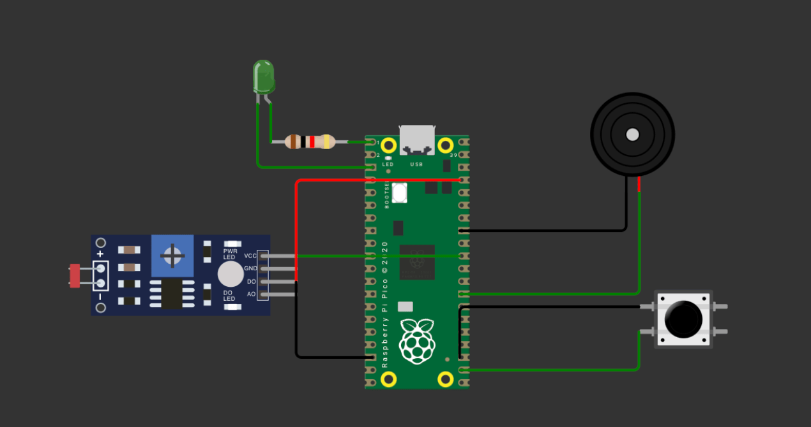
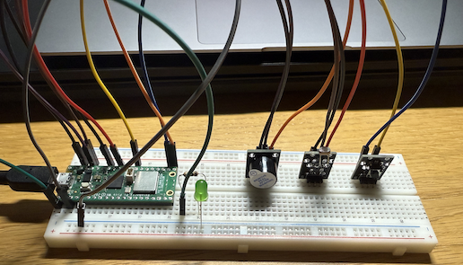

# CoolKeeper – Smart Fridge Door Monitor

**Author:** Serhii Sydoruk (ss226jh)

CoolKeeper is a simple IoT system that monitors if your fridge door has been left open using a light sensor (LDR). It uses Wi-Fi to connect to the internet and sends real-time alerts via Telegram. It's designed for use with the Raspberry Pi Pico WH and written in MicroPython.

---

## Objective

I built this device to address a common issue: leaving the fridge door open. Over time, this leads to energy waste and food spoilage. With CoolKeeper, I can get notified via Telegram if the fridge is open too long. This helps conserve energy and prevent food loss.

- **Chosen for:** Simplicity, usefulness, and learning experience
- **Purpose:** Detect fridge status and send real-time alerts
- **Insights:** Understanding MicroPython, GPIO input/output, network communication, and automation

---

## Material

| Component            | Function                          | Where bought    | Cost    |
| -------------------- | --------------------------------- | --------------- | ------- |
| Raspberry Pi Pico WH | Main microcontroller with Wi-Fi   | Electrokit.se   | 130 SEK |
| LDR sensor           | Detects ambient light             | From sensor kit | 39 SEK       |
| Active Buzzer               | Audio alert for fridge open state | From sensor kit | 32 SEK       |
| LED                  | Visual indicator of door open     | From sensor kit | 20 SEK|        |
| Push Button          | Toggle monitoring on/off          | From sensor kit | 19 SEK       |
| Jumper wires         | Connections                       | From sensor kit | 35 SEK       |
| Breadboard           | Prototyping platform              | From sensor kit | 69 SEK      |
| Resistor      | Voltage divider with LDR, pull-up | From sensor kit  | 1  SEK     |
*The LDR is connected to GP26 (ADC0), the LED to GP0, Buzzer to GP16, and the Button to GP17.*


---

## Computer setup

- **IDE:** Visual Studio Code

- **Steps:**

  - Install MicroPython firmware on Pico WH
  - Install `urequests` manually if not pre-installed
  - Configure Wi-Fi credentials in the script

- **Dependencies:** `network`, `urequests`, `machine`, `time`

---

## Putting everything together

- LDR to GP26 (ADC input)
- LED to GP0
- Buzzer to GP16
- Button to GP17 with pull-up resistor

Below is a basic schematic:

```text
[LDR] ----- GP26
   |
[LED] ----- GP0
[Buzzer] -- GP16
[Button] -- GP17
```

> Resistors: The LDR is part of a voltage divider. The button uses internal pull-up.


---

## Platform

- **Microcontroller:** Raspberry Pi Pico WH with Wi-Fi
- **Cloud Service:** Telegram API (for alerts)
- **Cost:** Free
- **Scalability:** Can be extended to support Ubidots, Blynk, or database logging

I chose Telegram because:

- Easy to set up
- Fast and reliable notifications
- Free and mobile-friendly
- My familey uses it

---

## The code

Core logic is in Python using MicroPython libraries:

```python
if light_level <= THRESHOLD:
    if not fridge_open:
        open_start_time = current_time
        fridge_open = True
        send_telegram("Fridge opened.")
    elif current_time - open_start_time >= 5:
        send_telegram("Fridge open > 5s")
        buzzer.on()
else:
    fridge_open = False
    buzzer.off()
    send_telegram("Fridge closed.")
```

Highlights:

- LDR detects light inside fridge
- Sends alert when door is open > 5 seconds
- Buzzer sounds and LED lights up
- Push button toggles system on/off
- Telegram bot sends status messages

---

## Transmitting the data / connectivity

- **Wi-Fi Protocol:** 802.11n (via Pico WH)
- **Transport Protocol:** HTTPS (via Telegram Bot API)
- **Update Frequency:** Every second (within main loop)

```python
def send_telegram(message):
    url = f"https://api.telegram.org/bot{TOKEN}/sendMessage"
    urequests.post(url, json={'chat_id': CHAT_ID, 'text': message})
```

- Light data is not stored, only status changes are sent
- Telegram is used due to its simplicity and instant delivery
- Could be optimized to reduce power use with sleep modes

---

## Presenting the data

No dashboard in this version; alerts are sent to Telegram

Possible to integrate with:

- Ubidots (for dashboards and analytics)
- Blynk or Node-RED in future

Sample Telegram messages:

```
CoolKeeper connected to Wi-Fi.
CoolKeeper monitoring started.
CoolKeeper Warning: Fridge open more than 5 seconds!
CoolKeeper Warning: Fridge open more than 5 seconds!
CoolKeeper monitoring paused.
```

---

## Finalizing the design

Below is the final project in action:





---

## Conclusion

- The project worked as intended
- Telegram integration was smooth
- Could be improved with:
  - Power saving modes
  - Battery operation
  - Dashboard integration (Ubidots)
  - Case/enclosure for safety


