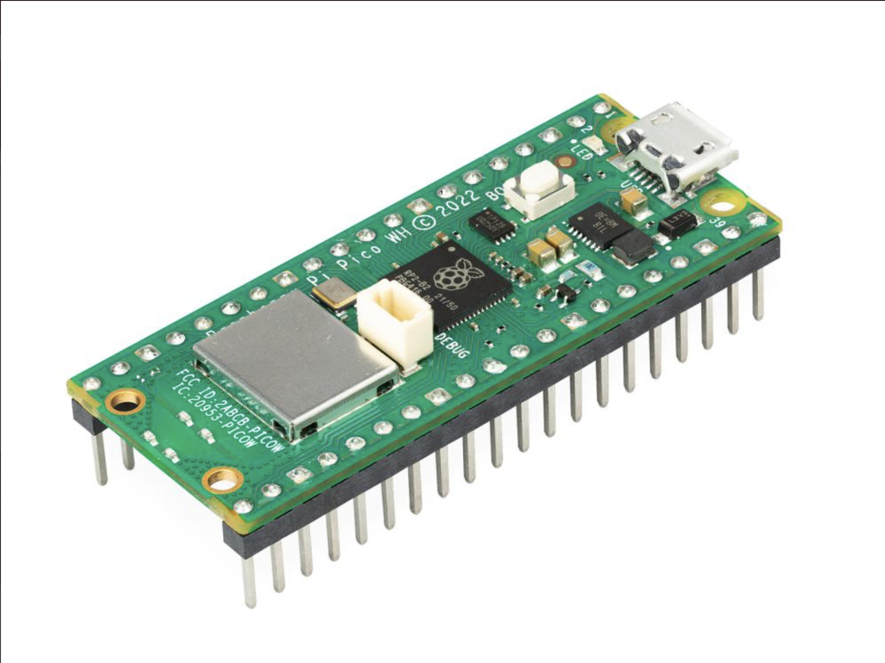

# CoolKeeper – Smart Fridge Door Monitor

**Author:** Serhii Sydoruk (ss226jh)

CoolKeeper is a smart IoT device that alerts you when your fridge door is left open. Using an LDR sensor, it detects light inside the fridge and sends real-time alerts to Telegram via Wi-Fi. Built using the Raspberry Pi Pico WH and written in MicroPython, it's simple, reliable, and useful for preventing energy waste and food spoilage.

---

## Objective

This device solves a common problem: accidentally leaving the fridge door open. When the door stays open longer than 20 seconds, CoolKeeper:

- Sends a **Telegram alert**
- Activates a **buzzer**
- Turns on an **LED**

It helps reduce power waste and keeps food fresh.

---

## Material

| Component                                       | Function                          | Where bought    | Cost    |
|-------------------------------------------------|-----------------------------------| --------------- | ------- |
| Raspberry Pi Pico WH  | Main microcontroller with Wi-Fi   | Start Kit       | 130 SEK |
| LDR sensor             | Detects ambient light             | From sensor kit | 39 SEK  |
| Active Buzzer       | Audio alert for fridge open state | From sensor kit | 32 SEK  |
| LED                   | Visual indicator of door open     | Start Kit       | 20 SEK  |
| Push Button         | Toggle monitoring on/off          | From sensor kit | 19 SEK  |
| Jumper wires         | Connections                       | Start Kit       | 35 SEK  |
| Breadboard      | Prototyping platform              | Start Kit       | 69 SEK  |
| Resistor          | Voltage divider                   | Start Kit       | 1  SEK  |

---

## Computer setup

- **IDE:** Visual Studio Code

- **Steps:**

  - Install MicroPython firmware on Pico WH
  - Install `urequests` manually if not pre-installed
  - Configure Wi-Fi, telegram bot and datacake url credentials in the script

- **Dependencies:** `network`, `urequests`, `machine`, `time` , `utime`

---

## Putting everything together

| Component       | GPIO Pin | Connection Details                                                                 |
|----------------|----------|-------------------------------------------------------------------------------------|
| **LDR Module** | GP26 (ADC0) | `VCC` → 3.3V, `GND` → GND, `OUT` → GP26 (ADC0). Includes built-in voltage divider|
| **LED**        | GP0      | Anode → GP0 through a **220Ω resistor**, Cathode → GND                              |
| **Buzzer**     | GP16     | Positive → GP16, Negative → GND                                                     |
| **Button**     | GP17     | One leg → GP17, other leg → GND. Uses internal pull-up resistor                     |

---

## Platform

- **Microcontroller:** Raspberry Pi Pico WH with Wi-Fi
- **Cloud Service:** Telegram API (for alerts)
- **Cost:** Free
- **Scalability:** Can be extended to support Ubidots, Blynk, or database logging

I chose Telegram because:

- Easy to set up
- Fast and reliable notifications
- Free and mobile-friendly
- My family uses it

---

## The code

### My project consists of two files:

### secrets.py
This file stores my private credentials:
```python
# --- Wi-Fi Data ---
SSID = "Your_WiFi_Name"
PASSWORD = "Your_WiFi_Password"

# --- Telegram Data ---
TELEGRAM_BOT_TOKEN = 'your_telegram_bot_token'
TELEGRAM_CHAT_ID = 12345  # Replace with your actual chat ID
# --- Datacake URL ---
DATACAKE_URL = "https://api.datacake.co/integrations/api/your_datacake_api_key/"
```
Upload this file to the Pico WH first.

### main.py

We import essential MicroPython libraries and set up global credentials:

- `machine`: Controls GPIO pins like ADC and digital I/O
- `network`: Handles Wi-Fi connectivity
- `urequests`: Sends HTTP requests (used for Telegram)
- `time`: Used for second-based timing
- `utime`: MicroPython-specific module used for millisecond precision
- `secrets`: A custom file where Wi-Fi credentials and Telegram bot info are securely stored

We also define global variables imported from `secrets.py`:

- **Wi-Fi credentials**: `SSID`, `PASSWORD`
- **Telegram Bot info**: `TELEGRAM_BOT_TOKEN`, `TELEGRAM_CHAT_ID`
- **DataCake**: `DATACAKE_URL`
```python
from machine import ADC, Pin
import time
import network
import urequests
import utime
import secrets


# --- Wi-Fi Data ---
SSID = secrets.SSID
PASSWORD = secrets.PASSWORD

# --- Telegram Data ---
TELEGRAM_BOT_TOKEN = secrets.TELEGRAM_BOT_TOKEN
TELEGRAM_CHAT_ID = secrets.TELEGRAM_CHAT_ID

# --- Datacake URL ---
DATACAKE_URL = secrets.DATACAKE_URL
```

### Hardware Setup
Each component is connected to a specific GPIO pin. Pull-up and analog configurations are applied here.
```python
ldr = ADC(0)
led = Pin(0, Pin.OUT)
buzzer = Pin(16, Pin.OUT)
button = Pin(17, Pin.IN, Pin.PULL_UP)
```

### State Variables
State variables help track fridge status, alert state, and timing of events.
```python
fridge_open = False           # Tracks if fridge is currently open
open_start_time = None        # Timestamp when fridge was opened
alert_sent = False            # Tracks if Telegram alert was sent
monitoring = False            # Indicates whether monitoring is active
last_beep_time = 0            # For periodic beeping of buzzer
fridge_warning_sent = False   # True if fridge open warning has already been sent
was_paused = True             # Used to detect state change from active to paused
toggle_message = None         # Stores message to send when toggling state
last_press_time = 0           # For button debounce timing

# --- Stats ---
open_times = 0
long_open_times = 0
open_duration = 0

THRESHOLD = 500               # LDR threshold 
SEND_INTERVAL = 30
```

### Connecting to Wi-Fi
This function connects your Raspberry Pi Pico WH to a Wi-Fi network using stored credentials.
```python
def connect_wifi():
    wlan = network.WLAN(network.STA_IF)
    wlan.active(True)
    wlan.connect(SSID, PASSWORD)
    print("Connecting to Wi-Fi...", end="")
    while not wlan.isconnected():
      print(".", end="")
      time.sleep(1)
    print("\nConnected, IP:", wlan.ifconfig()[0])
    send_telegram("CoolKeeper connected to Wi-Fi")
```

### Sending Telegram Alerts
This function handles sending messages to a Telegram chat using your bot token and chat ID.
```python
def send_telegram(message):
    url = f"https://api.telegram.org/bot{TELEGRAM_BOT_TOKEN}/sendMessage"
    data = {'chat_id': TELEGRAM_CHAT_ID, 'text': message}
    try:
        r = urequests.post(url, json=data)
        r.close()
        del r
    except Exception as e:
        print("Telegram send error:", e)
```

### Button Interrupt Handler
Toggles monitoring mode on or off when the button is pressed. Also handles resetting alert states and components.
```python
def button_pressed(pin):
    global monitoring, fridge_open, open_start_time, alert_sent
    global was_paused, toggle_message, last_press_time
    
    current_time = utime.ticks_ms()
    if utime.ticks_diff(current_time, last_press_time) > 300:
        last_press_time = current_time
        monitoring = not monitoring
        if monitoring:
            toggle_message = "Monitoring started. Press the button to pause"
            was_paused = False
        else:
            toggle_message = "Monitoring paused. Press the button to resume"
            fridge_open = False
            open_start_time = None
            alert_sent = False
            led.off()
            buzzer.off()
```

Button Interrupt Setup
```python
button.irq(trigger=Pin.IRQ_FALLING, handler=button_pressed)
```
### DataCake sender
Send statistic in json format to DataCake for visualization
```python
def send_to_datacake(open_times, long_open_times, open_duration):
    payload = {
        "device": "CoolKeeper",
        "OPEN_TIMES": open_times,
        "LONG_OPEN_TIMES": long_open_times,
        "OPEN_DURATION": open_duration
    }
    try:
        r = urequests.post(DATACAKE_URL, json=payload)
        print("Datacake response:", r.text)
        r.close()
        print("Data sent to Datacake:", payload)
    except Exception as e:
        print("Datacake send error:", e)
```

### Initial Setup
Connects to Wi-Fi and sends a startup message. This is the first step before the monitoring loop begins.
```python
connect_wifi()
send_telegram("Press the button to start monitoring")
last_datacake_send = time.time()
```

### Main Loop
This is the core logic that runs repeatedly. It checks the light level, determines fridge status, and sends alerts.
```python
while True:
    if toggle_message:
        print(toggle_message)
        send_telegram(toggle_message)
        toggle_message = None

    if monitoring:
        light_level = ldr.read_u16() // 64
        print("Light level:", light_level)
        current_time = time.time()

        if fridge_open and open_start_time is not None:
            open_duration += 1

        # --- Fridge is open ---
        if light_level <= THRESHOLD:
            if not fridge_open:
                print("Fridge OPEN")
                open_times += 1
                open_start_time = current_time
                fridge_open = True
                alert_sent = False
                last_beep_time = 0
                led.on()

            elif open_start_time is not None and current_time - open_start_time >= 20:
                if not alert_sent:
                    send_telegram("Warning: Fridge open more than 20 seconds!")
                    long_open_times += 1
                    alert_sent = True
                    fridge_warning_sent = True
                    last_beep_time = current_time

                if current_time - last_beep_time >= 1:
                    buzzer.on()
                    time.sleep(0.1)
                    buzzer.off()
                    last_beep_time = current_time

        # --- Fridge is closed again ---
        else:
            if fridge_open:
                print("Fridge CLOSED")
                fridge_open = False
                open_start_time = None
                alert_sent = False
                led.off()
                buzzer.off()
                if fridge_warning_sent:
                    send_telegram("Fridge has been closed")
                    fridge_warning_sent = False
    else:
        led.toggle()
        time.sleep(0.5)
        if not was_paused:
            was_paused = True

    # --- Send stats to Datacake every 30 seconds ---
    if time.time() - last_datacake_send >= SEND_INTERVAL:
        send_to_datacake(open_times, long_open_times, open_duration)
        open_times = 0
        long_open_times = 0
        open_duration = 0
        last_datacake_send = time.time()

    time.sleep(1)
```

## Presenting the data
### Dashboard(Datacake):

CoolKeeper logs fridge activity to Datacake for live and historical tracking

The dashboard shows:
- open_times – Number of times the fridge was opened
- long_open_times – Times the fridge stayed open longer than 20 seconds
- open_duration – Duration (in seconds) for each fridge open event


### Sample Telegram messages:

```
CoolKeeper connected to Wi-Fi.
Press the button to start monitoring
Monitoring started. Press the button to pause
Warning: Fridge open more than 20 seconds!
Fridge has been closed
Monitoring paused. Press the button to resume
```

---

## Finalizing the design

Below is the final project in action:


---

## Conclusion
CoolKeeper successfully:
- Detects fridge door status
- Sends Telegram alerts
- Notifies with buzzer and LED
- Lets you pause/resume monitoring with a button

It was a great learning experience in:
- MicroPython programming
- Wi-Fi and API integration
- Interrupts and sensor logic on embedded devices
- Data visualization using DataCake

Future Improvements
- Add temperature sensor for full fridge status
- Use a low-power mode to conserve energy
- Add battery backup (e.g., LiPo with charging circuit)

